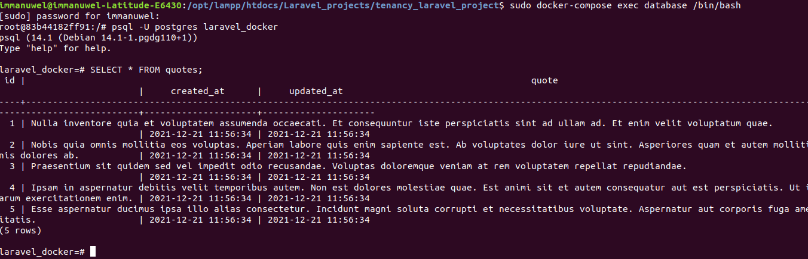
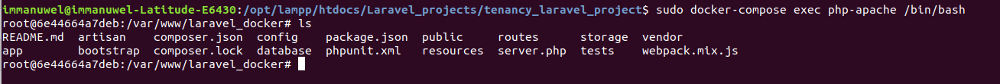

## STEPS TO RUN THE PROJECT

##### 1) verify that you have docker on your OS

##### 2) verify that you have docker-compose installed on you OS

##### 3) Run the Docker Compose file 

Go to the root of the project and run 
> docker-compose up -d --build 

##### 4) Rest of the tutorial
[tutorial](https://www.twilio.com/blog/get-started-docker-laravel)

##### 5.A)Go to the a terminal to log to the apache container
execute the command the following

1) Go inside the container 
> sudo docker-compose exec php-apache /bin/bash

2) Migrate table 
> php artisan migrate

3) Seeding database 
> php artisan db:seed

#### 5.B) Go to another terminal to log to the postgresql docker container 
run teh following command 

1)login command
> sudo docker-compose exec database /bin/bash

2) login to the postgresql database
> psql -U postgres laravel_docker

3) displaying the database data 
> SELECT * FROM quotes;

##### 5.B) go to your host domain:8080/quotes
You will see the data for the database 